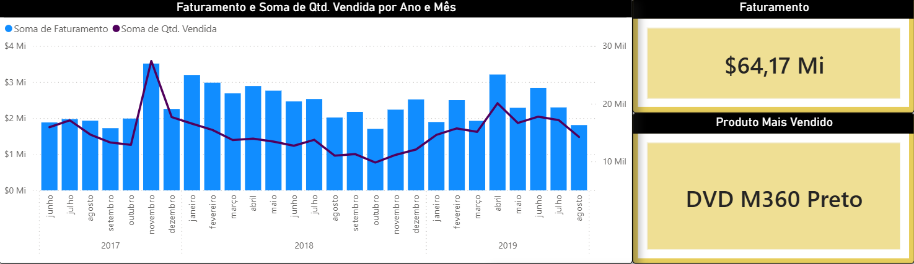
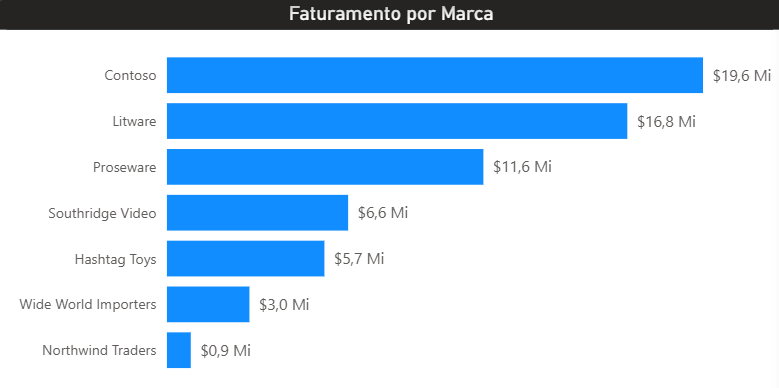

> ### Os dados utilizados neste projeto são fictícios de estudo, com finalidade exclusivamente educacional e demonstrativa,

## Análise de Vendas e Faturamento Anual
### 1. Problema de Negócio

- A empresa possui um grande volume de dados de vendas ao longo do ano, porém não consegue extrair informações claras sobre seu desempenho comercial.

- A falta de visibilidade sobre o faturamento, os produtos mais vendidos e a contribuição de cada empresa/parceiro dificulta a tomada de decisões estratégicas, como definição de metas, foco comercial e planejamento de estoque.

- O principal desafio do negócio é entender como o faturamento está distribuído, quais produtos geram mais receita, quais vendem mais em volume e quais empresas concentram as vendas, de forma clara e objetiva.

### 2. Contexto

A operação comercial envolve diferentes fatores que impactam diretamente os resultados de vendas, como:

- produtos vendidos,

- quantidade vendida por continente, 

- quantidade vendida,

- valor unitário,

- faturamento total,

- período de venda ao longo do ano.

A empresa já armazena essas informações em uma base de dados histórica, porém elas não são utilizadas de forma analítica para apoiar decisões estratégicas.

O objetivo deste projeto é transformar dados brutos de vendas em insights acionáveis, por meio de análises descritivas e visualizações simples, que possam ser facilmente compreendidas por áreas como Comercial, Financeiro e Gestão.

### 3. Premissas da Análise

Para a realização da análise, foram adotadas as seguintes premissas:

- O faturamento foi calculado a partir da multiplicação entre quantidade vendida e valor unitário do produto.

- A quantidade vendida representa o volume total comercializado por produto ao longo do ano.

- Os dados analisados correspondem a um período anual completo.

- Registros com valores ausentes ou inconsistentes foram tratados ou removidos quando necessário.

A análise tem foco descritivo, visando identificar padrões e concentrações, não estabelecer causalidade estatística.

### 4. Estratégia da Solução

A estratégia adotada seguiu uma abordagem estruturada de análise de dados:

### 4.1 Entendimento do problema de negócio

Definir quais métricas são mais relevantes para avaliar o desempenho de vendas e faturamento.

### 4.2 Exploração e organização dos dados

Análise das colunas disponíveis, tipos de dados, possíveis inconsistências e padronização das informações.

### 4.3 Análise descritiva

Cálculo de métricas como:

- faturamento total,

- faturamento por produto,

- faturamento por empresa,

- quantidade total vendida,

- produto mais vendido de cada empresa.

### 4.4 Segmentação das vendas

Avaliação do desempenho por diferentes dimensões:

- produto,

- empresa,

- período (mês/ano).

### 4.5 Visualização dos dados

Criação de gráficos e indicadores claros para facilitar a interpretação e comunicação dos resultados com o negócio.

## 5. Insights da Análise

A análise dos dados permitiu identificar padrões relevantes, como:

- O faturamento anual total atingiu um valor significativo, concentrado em poucos produtos.

- Um pequeno grupo de produtos representa a maior parte do faturamento total da empresa.

- O produto mais vendido em quantidade não necessariamente é o que gera maior faturamento.

- Algumas empresas concentram grande parte do volume de compras, enquanto outras possuem participação menor.

  
  

Esses insights mostram que o desempenho de vendas não é homogêneo e que decisões estratégicas podem ser tomadas com base na concentração de faturamento e volume.

## 6. Resultados

Como resultado do projeto, foram obtidos:

- Identificação clara do produto mais vendido em quantidade.

- Identificação do produto que gera maior faturamento.

- Visão consolidada do faturamento anual.

- Análise da participação de cada empresa no total de vendas.

- Diagnóstico visual dos produtos e empresas mais relevantes para o negócio.

- Base analítica para apoiar decisões comerciais e financeiras.

- Relatórios e dashboards acessíveis para áreas não técnicas.

Além disso, o projeto demonstra como a análise de dados pode transformar dados de vendas em informações estratégicas, mesmo utilizando técnicas analíticas simples.

## 7. Próximos Passos

Com base nos resultados obtidos, os próximos passos recomendados são:

- Aprofundar a análise por período (mensal ou trimestral).

- Identificar produtos com alto potencial de crescimento.

- Avaliar estratégias de precificação para produtos de alto volume e baixo faturamento.

- Monitorar continuamente o faturamento e volume de vendas por meio de dashboards.

Cruzar dados de vendas com informações de estoque e margem de lucro.

Este projeto representa um passo importante rumo a uma cultura orientada a dados, onde decisões comerciais passam a ser guiadas por evidências e não apenas por intuição.

### Observação: os dados utilizados neste projeto são fictícios de estudo, com finalidade exclusivamente educacional e demonstrativa,
 O dashboard completo foi desenvolvido no Power BI Desktop.
 Prints foram utilizados devido à não publicação online do relatório. 

